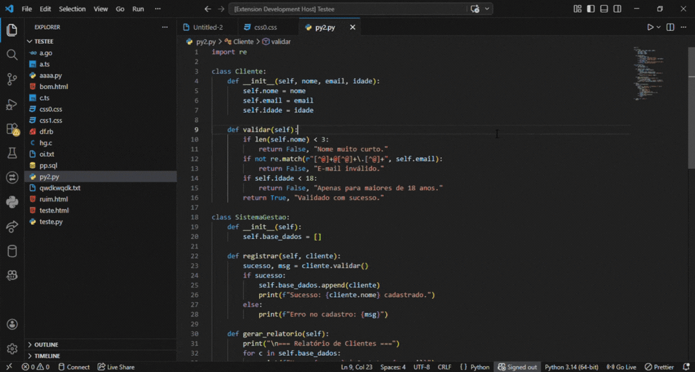

# 🤖 AI Code Reviewer

The **AI Code Reviewer** is a professional VS Code extension that transforms your editor into a high-level Senior Pair Programming environment. Using the Google Gemini API, it provides structured, secure, and deeply technical code audits.

## ✨ Key Features

- **Professional Markdown Reports:** Every audit generates a comprehensive Markdown dashboard. These reports include a visual scoring system, technical analysis, detection of _code smells_, and specific refactoring suggestions.
- **Language-Specific Intelligence:** The engine doesn't use generic prompts. Each supported language has its own specialized review template to ensure the feedback respects the idioms and best practices of that specific ecosystem.
- **Total Customization:**
  - **Model Selection:** Toggle between different Gemini models, such as `gemini-2.5-flash-lite`, directly through your settings.
  - **Response Language:** Choose your preferred language for the analysis reports (e.g., English or Portuguese).
- **Smart Optimization & Security:**
  - **Token Efficiency:** Automated logic to strip empty lines and whitespace before processing, maximizing your context window.
  - **Safety Thresholds:** Built-in safeguards for large files (e.g., 4300+ useful lines) to prevent API failures and maintain high analysis quality.
- **API Resilience:** Advanced handling for "503 Service Unavailable" errors and high-demand spikes, ensuring a smooth workflow even during server congestion.

## 🛠️ Supported Languages

The engine provides specialized analysis for a wide range of technologies:

| Category             | Languages                                       |
| :------------------- | :---------------------------------------------- |
| **Web & Backend** | TypeScript, JavaScript, PHP, Ruby, Go, C#, Java |
| **Systems** | C, C++, Python                                  |
| **Gaming & Scripts** | Lua, Luau                                       |
| **Markup & Style** | HTML, CSS                                       |

## 🚀 How to Use

After installing the extension, follow these simple steps to start your first audit:

1.  **Configure your API Key:** Go to `File > Preferences > Settings` (or press `Ctrl+,`), search for **AI Reviewer**, and paste your **Google Gemini API Key**.
2.  **Open a code file:** Open any source file in one of the supported languages.
3.  **Start the Review:** * Right-click anywhere inside the editor and select **"Review Code with AI"**.
    * Alternatively, use the Command Palette (`Ctrl+Shift+P`) and type "Review Code".
4.  **Analyze the Report:** A new Markdown panel will open instantly with a detailed technical analysis and scoring.

## ⚙️ Available Settings

You can fully customize your experience through the VS Code Settings:

* **API Key:** Your personal Google Gemini credentials.
* **Model:** Select between different versions of the engine (e.g., `gemini-2.0-flash`, `gemini-1.5-pro`).
* **Language:** Choose whether the analysis reports should be generated in **English** or **Portuguese**.

### 📝 Important

You must provide your own **Google Gemini API Key** in the extension settings to enable the analysis features.

**Developed by Pedro Goulart Branco**